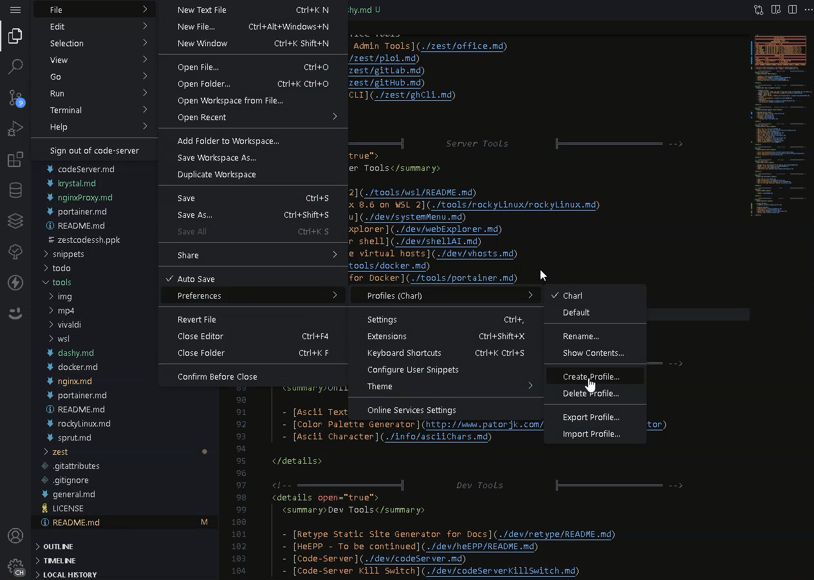
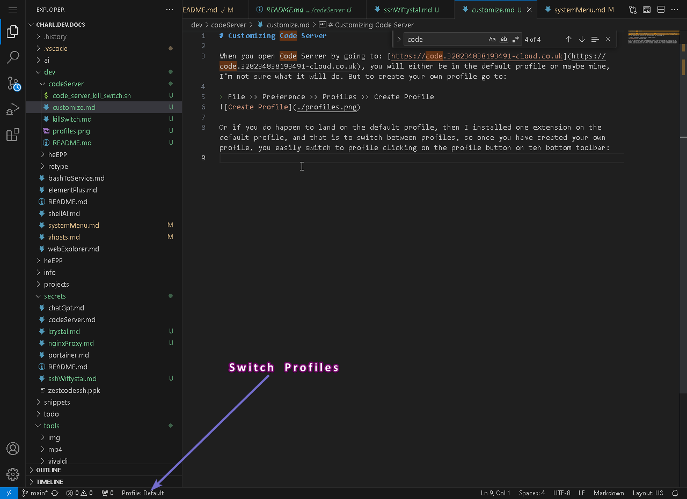

# Customizing Code Server

When you open Code Server by going to: [https://code.328234838193491-cloud.co.uk](https://code.328234838193491-cloud.co.uk), you will either be in the default profile or maybe mine, I'm not sure what it will do. But to create your own profile go to:

> File >> Preference >> Profiles >> Create Profile

Or if you do happen to land on the default profile, then I installed one extension on the default profile, and that is to switch between profiles, so once you have created your own profile, you easily switch to profile clicking on the profile button on teh bottom toolbar:

