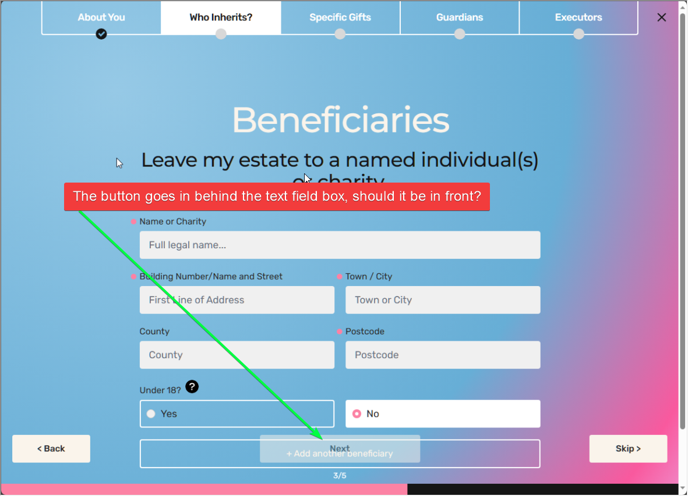
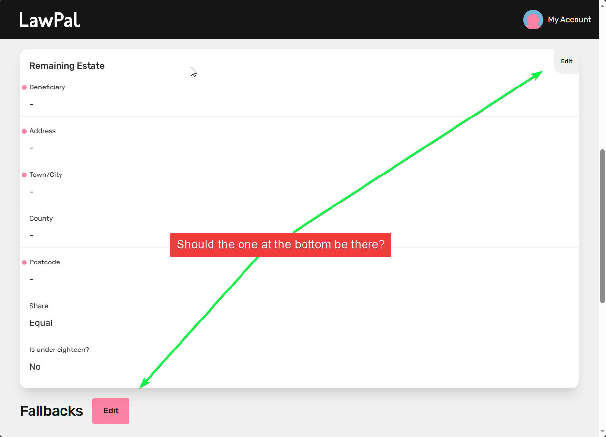
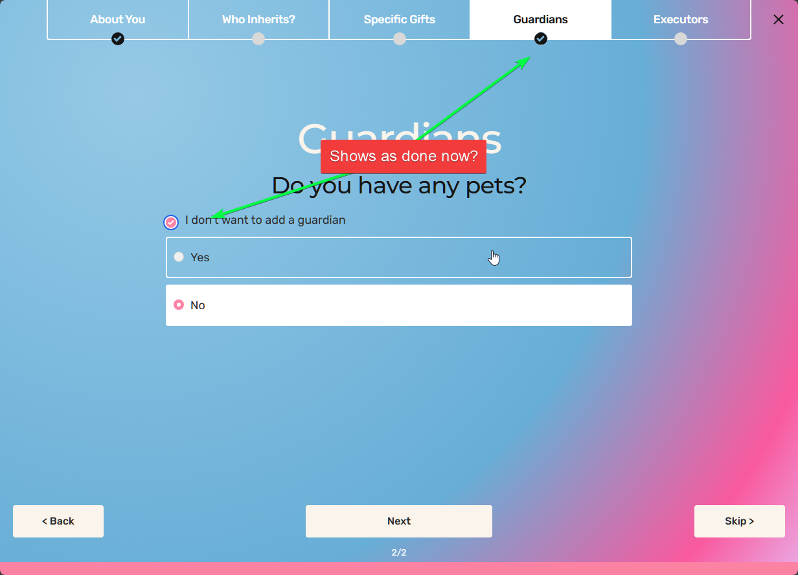

# Initial Updates

1.General - Esthetics
   

Harry Robinson:  *Ignore this for now, she will be raising this on a future phase*

Harry Robinson:  *I think these are different area's, please can you see if they do the same thing? If they do, just remove the top right one*

2. Can we add a tick box in *Guardians* to say ‘I don’t want to add a guardian’ as if someone does not want to, then it will appear as incomplete at the *review* stage.

Harry Robinson: *This looks like it could be a bit of overlap from what the previous dev did, please can you remove the top option and add that text to the "No" option?*

3. Once a person has been chosen, then the Choose a person already in the will dropdown should grey out.

> Not all browsers supports greying out of items in a dropdown, some andoid devices will fallback to the default dropdown and the item will look as normal.  Whould I worry about this?

Harry Robinson: *Don't worry about this, we normally only support modern browser versions for our clients nowadays.*