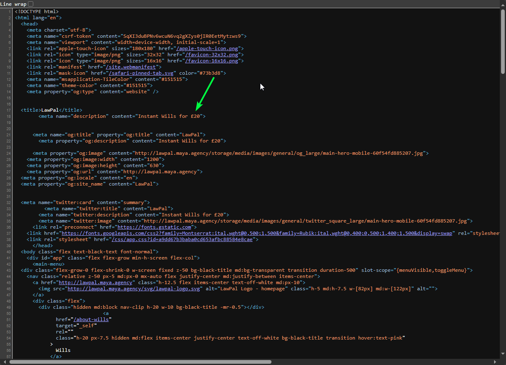
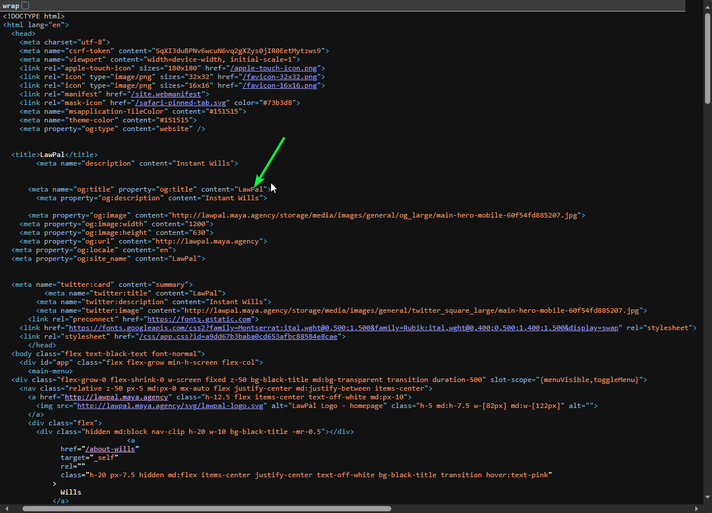
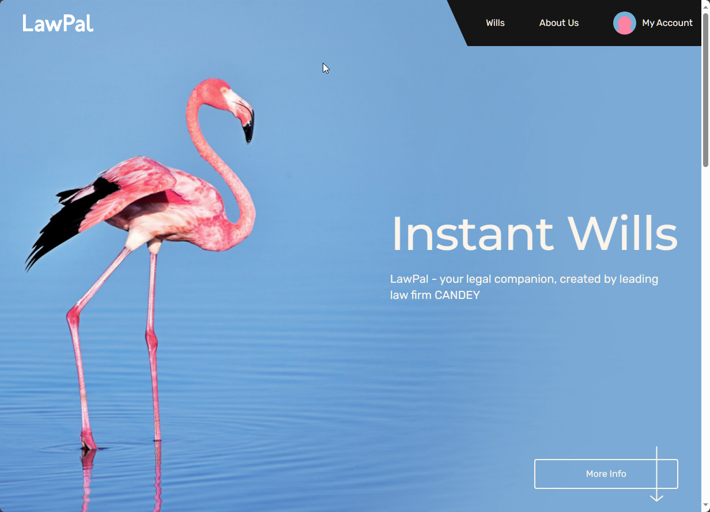
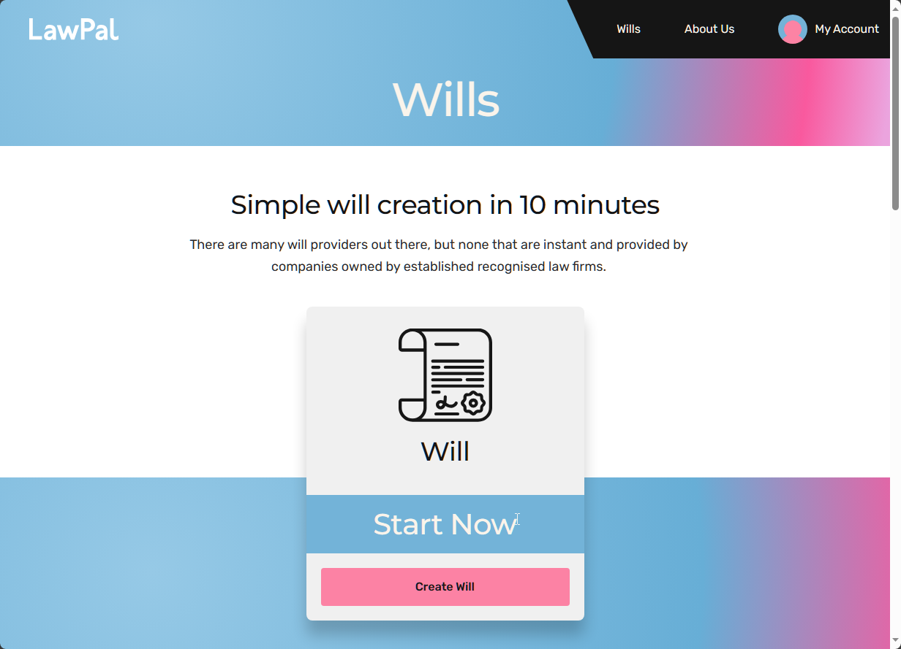
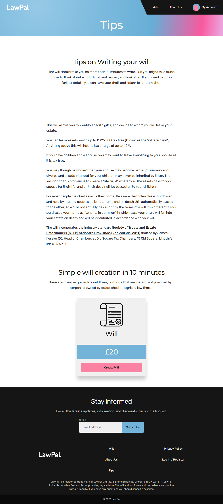

# Phase 1: Enhancements for User Flow and Interface Consistency

### 1.1. Do not prevent users from proceeding Next
Marek suggested we do not prevent users from proceeding `Next` in case they are leaving info they do not have yet, and they wish to come back to, but this should not prevent the user from being able to progress and complete as much as they can.
> For this, we'll have to code a lot of logic in to allow for saving of partially completed data so the user can return back as well as add new validation to the end of the process.

### 1.2. Cursor updates and review
His other feedback re `Next` was that if it is to be greyed out, then the cursor should change to demonstrate this is not something you can click on. Currently the `cursor` shows a hand so gives the impression that the user should be able to click on it, which may lead the user to think there is an issue with the website. Should be a circle with a diagonal line through it. However if we action his feedback to allow the user to press `Next` even if they have not completed all info then this will not be a problem. _Marek advised that at the end the user can see which info has not been populated and needs to be completed when taken to the `Review` bit. So this covers the user in terms of prompts for which bits they need to complete._
> Covered by the above task

### 1.3. Confirm next and skip to be consistent
Can you please confirm & test the functionality for `Next` and `Skip` as sometimes there are inconsistencies where they each are doing random things. Intuitively as a user we presume `Next` takes us to the next page of a section whereas `Skip` skips to the start of the next section. Currently this is inconsistent. Also on some pages there is no skip button at all, how come?
> Notes: This section will be recoded so the user is taken to the relevant section depending on their current page. The skip button will also be consistent throughout.

### 1.4. Next is not necessary under Specific Gifts or under Executors
`Next` is not necessary under `Specific Gifts or under Executors` as it is the end of the process or as it is only one page. We can just have `Skip` on there.
> Notes: We can conditionally hide this area for you

### 1.5. Remove all reference to £20 please  

#### In Meta Data

Removed from Meta Data

#### On Home Page

Removed from Home Page

#### Wills Page

Removed from Wills Page

#### Tips Page

Removed from Tips Page

