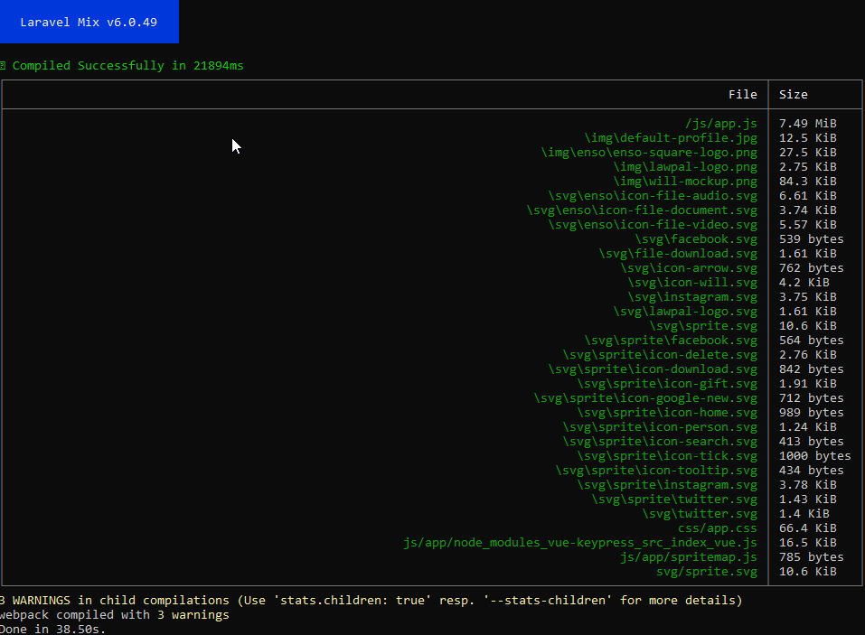

# Update Yarn

Here are some possible solutions:

1. **Update your yarn packages** - The simplest step to try first is to update your yarn packages. You can do this by running the command `yarn upgrade` in your project root directory. This will update all dependencies to the latest versions according to the versioning specified in your `package.json` file [stackoverflow.com](https://stackoverflow.com/questions/62246824/error-err-package-path-not-exported-no-exports-main-resolved-in-app-node-m), [bobbyhadz.com](https://bobbyhadz.com/blog/node-error-err-package-path-not-exported).

```sh
 yarn upgrade
```

2. **Reinstall node\_modules** - If updating yarn packages doesn't solve the issue, you can try deleting your `node_modules` and `yarn.lock` (not `package.json`) files, then re-run `yarn install` [bobbyhadz.com](https://bobbyhadz.com/blog/node-error-err-package-path-not-exported).

```sh
rm -rf node_modules
rm -f yarn.lock 
yarn cache clean 
yarn install
```

3. **Check your Node.js version** - Ensure you're running the Long-Term Support (LTS) version of Node.js. Node.js versions can sometimes introduce breaking changes, and running the LTS version helps ensure compatibility with a wider range of packages [bobbyhadz.com](https://bobbyhadz.com/blog/node-error-err-package-path-not-exported).

```sh
 nvm install --lts    
 nvm use --lts
``` 

If you're not using `nvm`, you can download the LTS version from the official Node.js website.

4. **Install missing dependencies** - In some cases, the issue might be resolved by installing or updating specific dependencies. For example, in the case of `vue-loader`, running `yarn upgrade vue-loader` or `yarn add vue-loader` solved the issue [stackoverflow.com](https://stackoverflow.com/questions/69631437/error-cannot-find-module-webpack-lib-rules-descriptiondatamatcherruleplugin-r).

Remember to restart your IDE and dev server after each step, as sometimes the changes may not be reflected until a restart.

If none of the above solutions work, the issue might be deeper and require looking into the specific packages causing the error.

After you have updates `Yarn` try running the follwing:

```sh
yarn run dev
```

You should get the following output:

