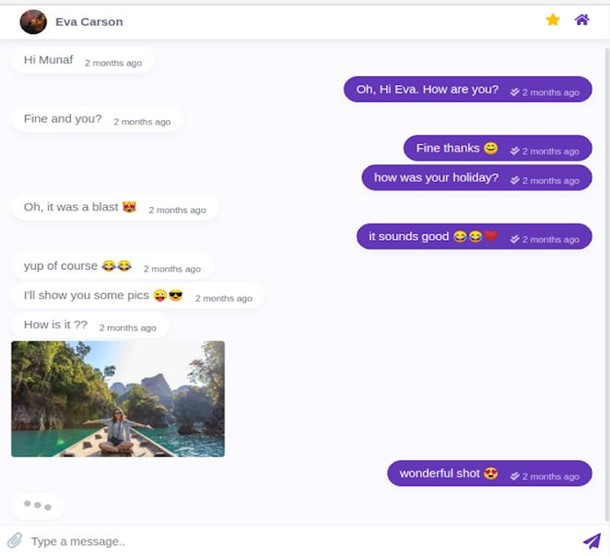

# Approved Work

1. [x] [Super admin more data notifications](#super-admin-more-data-notifications)
2. [x] [Email notification triggers when practice creates shifts in their area](#email-notification-triggers-when-practice-creates-shifts-in-their-area)
3. [x] [Email notification weekly for practices](#email-notification-weekly-for-practices)
4. [ ] [Super admin - map view of the locums location](#super-admin-map-view-of-the-locums-location)
5. [ ] [Search via practice name. Add to keyword section.](#search-via-practice-name-add-to-keyword-section)
6. [ ] [Chat function](#chat-function)
7. [ ] [Per practice / multiple practice on the same portal](#per-practice-multiple-practice-on-the-same-portal)
8. [ ] [Change My application page to my profile page](#change-my-application-page-to-my-profile-page)
9. [ ] [Better calendar system for creating shifts](#better-calendar-system-for-creating-shifts)
10. [ ] [Super admin dashboard under locums, filter for role, location, availability](#super-admin-dashboard-under-locums-filter-for-role-location-availability)

### Super admin more data notifications
For this task, a daily job will run to collate the total number of practice sign-ups, shifts added, applications made and locums registered. This will send every day at midnight and will get information from 12am the previous day so it’s a full 24hr period.
> 2.5hrs (£200 Ex VAT)

### 2. Email notification triggers when practice creates shifts in their area
These emails will be sent automatically to Locums on a weekly basis letting them know how many jobs have been added in a 20 mile radius of them this week. This email will be sent on a Sunday at 12pm to all Locums who have had a shift match which is still marked as open / available.

If a shift has been created that week and is within 20 miles of a Locum it will only be a part of the notification if it’s not fulfilled / closed.

The email will just mention the total number of these shifts that have been added but will link to the MLM jobs pageant each shift for the user to find them and apply etc.
> 3hrs (£240 Ex VAT)

### 3. Email notification weekly for practices
Similarly to the Locum notification, the practices will get the exact same email but in reverse so it would instead show how many Locums have registered within 20 miles of the practices main address.  In the future this will be adjusted to only show Locums that have “Open to travel” checked.

This will not put any personal details of the Locums in the email.
> 3hrs (£240 Ex VAT)

### 4. Super admin - map view of the locums location
When on Locum page, the admin will be shown an interactive map of where all Locums are in the country. This will be a simple Google Map with markers of the Locum’s location. The drag and zooming support will be retained for this and clickable on each marker will take admin to locum edit page. 
> 1hr (£80 Ex VAT)

### 5. Search via practice name. Add to keyword section.
On the locum portal, on the jobs page. When using the ‘search bar’ can we please ensure practice names can be searched. For example - If a practice has uploaded a shift and a locum wants to find them. They can put the practices name in the search bar and all their shifts will come up. 
> 1hr (£80 Ex VAT)

### 6. Chat function
The chat functionality will be custom coded into the platform for both Locums & Practices. It will sit as a new link in the navigation bar, once clicked it will load up the chat page which will work similarly to how Facebook Messenger works.

It will be similar to the below reference:

Users will be able to to send files and plain text messages + emojis via the chat. Sending emails / phone numbers will be auto-rejected to avoid people using it for the wrong purpose. 

Calling people via the platform will not be immediately supported as it will be a task in it’s own right but it makes sense to get the chat built first then bolting on and quoting the calling support once developed so we can figure out the best solution whilst minimising recurring costs.

On the left side of the main chat area will be a list of users and a small snippet of the last message sent. 

A bell will also be instated at the top header bar for Locums + Practices which will show a number in a red buble if they have unread messages. Email to be sent to notify a message is waiting to be read. 

If the shift is then accepted the chat is closed. 

●	Time response. On practices. E.g The vet practice normally takes 3-4 hours to respond.  

> 20hrs (£1,600 Ex VAT)

### 7. Per practice / multiple practice on the same portal
This task is to add multi-user support to practices. An additional page will be required on the Practice side called “My Team”. Clicking this will list out members of the same practice along with an “add new” which will trigger a similar popup to what’s mentioned in the “Refer a friend” task. 

A delete button will be shown against each user which when clicked, will remove the user from MLM immediately and reassign all of the users content to the person that deleted them to ensure nothing is lost or mismatched.

Clicking “invite” will email the email address entered and send them a special link to follow to accept the invitation. The user will then go through the same steps a user takes to register the account initially however, the “Practice Details” step will be skipped.

There will not be a requirement for user roles here at this point and a single user can only be associated with a single practice.
> 12hrs (£960 Ex VAT)

### 8. Change My application page to my profile page 

On the locum portal. Please change the ‘my application page’ to my profile page’. This will show the locum what their profile looks like when they apply for a shift. E.g profile picture, bio, rating.  An edit button will be next to this and take them to their account page where they can edit their profile. 
Under this will be a table which has sections called ‘pending, confirmed, declined, canceled’ . This will be for shifts. 

Under that is a simple box called ‘ next shift coming up: This just states the next shift that the locum is due to work. 

Assuming the profile fields on the form remain the same, the quote is as follows: 
> 3hrs (£240 Ex VAT)

### 9. Better calendar system for creating shifts
The functionality here will be changed so you can no longer pick a date range using two date inputs and instead, the user will have to pick specific dates from a calendar, to make this easier they will have some form control above the calendar to bulk fill these calendar slots, this is further described below:

Create slots every [select days of the week] for the next [select number of weeks] weeks

The days of the week option will trigger a select input to open, allowing the user to select multiple days of the week they are creating it for.

A calendar will also be added to the shift page above the shift table. This will allow practices to see all shifts they have created via a calendar. A traffic light system can be used to show which are fulfilled, which are open. 
> 16hrs (£1,280 Ex VAT)

### 10. Super admin dashboard under locums, filter for role, location, availability
Initially, the filter for “availability” will not be added until during phase 2.3 when the calendar support is added.

The Role & Location will be required here though, they will be added as additional columns to the table. The role will be a select input allowing the admin to select an option from a pre-set list, the location column will be a text input allowing the admin to search by City + Postcode which will also be shown in each row. Adding address line 1 and 2 here will bloat the rows and make it far too big.
> 2hrs (£160 Ex VAT)
